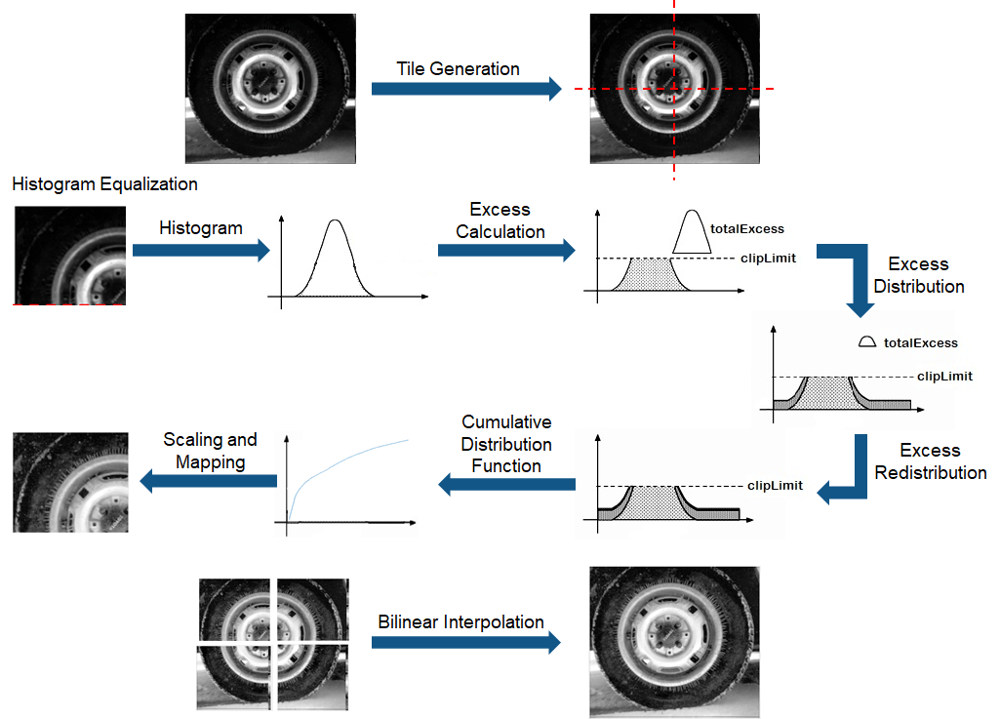

# CLAHE GUI

This is supposed to ba a simple GUI to demonstrate the effect of Constrastive Limited Adaptive Histogram Equilization on any type of input image.

## What is Contrastive Limited Adaptive Histogram Equilization (CLAHE)

A CLAHE actually takes the LAB components of the image and calculated a histogram decomposition for each channel for a specific patch size.
 For each patch:

   - take histogram distribution
   - calculate the excess from the clip limit
   - distribute this excess equally over all non-excessing pixels
   - overlay with gaussian frame

Then it takes the overlapp average over all patches, reconstructing the original image equalizes.

This app additionally reconverts the color space back to BGR and displays the result.

*Demonstration of CLAHE processon images (MATLAB (c))*

## Requirements

- OpenCV
- Spring
